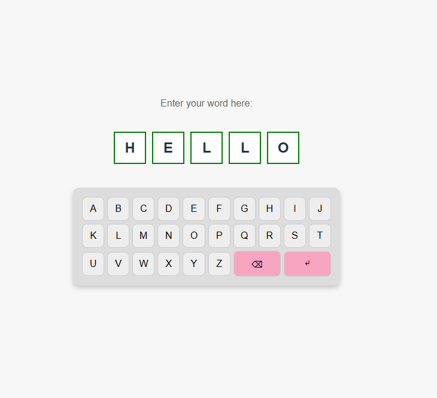

# 🏆 Keyboard App

A simple interactive keyboard game where users enter words using an on-screen keyboard. The app verifies the word's validity using an online dictionary API.

## 🚀 Features
- 🎹 **On-screen keyboard** that mimics a real keyboard layout.
- 📝 **Word validation** using an online dictionary API.
- 🎨 **Responsive UI** with a clean and intuitive design.
- 🔥 **FastAPI backend** to handle API requests.
- 🌍 **CORS-enabled** for seamless communication between frontend and backend.

## 🖼️ Preview


## 🛠️ Tech Stack
### Frontend:
- **React.js** (Vite setup)
- **CSS** (for styling and layout)
- **Fetch API** (to interact with the backend)

### Backend:
- **FastAPI** (Python)
- **Dictionary API** (for word validation)
- **CORS Middleware** (for cross-origin requests)

---

## 📦 Installation & Setup

### 1️⃣ Clone the Repository
```sh
git clone https://github.com/YOUR_USERNAME/keyboard-app.git
cd keyboard-app
```
### 2️⃣ Start the Backend (FastAPI)
```sh
cd backend
pip install -r requirements.txt
uvicorn MyActionListener:app --reload
```
### 3️⃣ Start the Frontend (React)
```sh
cd keyboard-app
npm install
npm run dev
```
